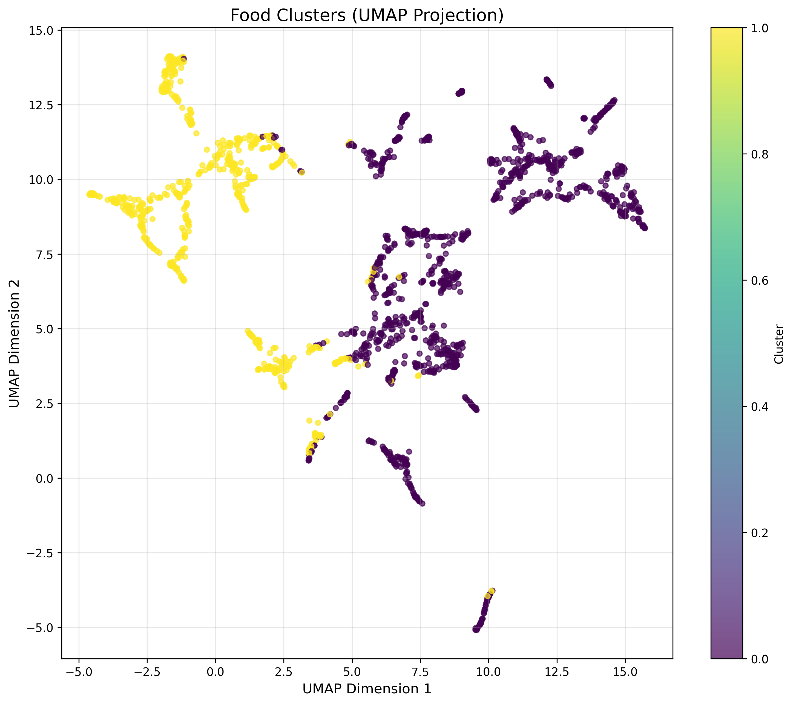

# Food with Similar Nutrients

A project to group Norwegian food items by their nutritional characteristics to help find alternative foods with similar nutritional profiles.

This work was completed as part of the course "Introduction to artificial intelligence applied to organizations and industries" at the Oslo Metropolitan University Norway. 

## Overview

This project uses machine learning techniques to analyze the Norwegian Food Composition Database, grouping foods with similar nutritional properties. This can help users:

- Find alternative food items when specific ingredients aren't available
- Make healthier food choices with similar nutritional profiles
- Select foods based on nutritional requirements, carbon footprint, or price

## Data Source

The dataset is from the Norwegian Food Safety Authority's [Food Composition Database](https://www.matportalen.no/verktoy/matvaretabellen/), containing:
- 1878 food items
- 57 nutritional attributes per food item
- Information on energy, macronutrients, micronutrients, and more

## Features

- **Data Preprocessing**: Cleans and normalizes the raw nutrient data
- **Clustering Analysis**: Groups similar foods using K-means clustering
- **Dimensionality Reduction**: Uses UMAP for visualizing high-dimensional data
- **Interactive Visualizations**: Explore the food clusters visually
- **Food Alternative Finder**: Find similar foods based on nutritional content

## Installation

```bash
# Clone the repository
git clone https://github.com/MeenaBana/food-with-similar-nutrients.git
cd food-with-similar-nutrients

# Create virtual environment 
python -m venv venv
source venv/bin/activate  # On Windows: venv\Scripts\activate

# Install required packages
pip install -r requirements.txt
```

## Usage

### Data Processing and Analysis
```bash
# Run the main analysis script
python src/food_analysis.py
```

### Interactive Food Explorer
```bash
# Launch the interactive dashboard
python src/food_explorer.py
```

## Results

The analysis identified distinct clusters of foods sharing similar nutritional profiles. These clusters can help users find alternative foods with comparable nutrient compositions.



## Next Steps

Future enhancements:
- Add carbon footprint data and eco-friendly production information
- Develop a web or mobile application for easy access
- Integrate with meal planning systems
- Add more personalization options based on dietary preferences